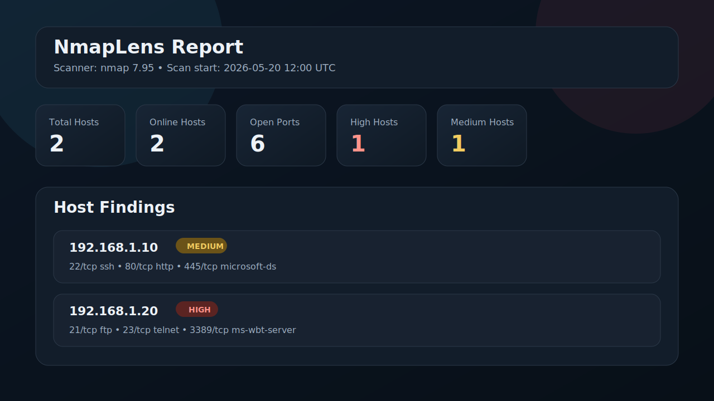

# NmapLens


NmapLens is a beginner-friendly but professional Python command-line tool that reads Nmap XML scan results and generates HTML, JSON, and Markdown security reports.



## Why NmapLens

Nmap XML output is powerful, but it is not always easy to read quickly, especially for beginners. NmapLens turns raw scan results into a cleaner report with risk levels, plain-language explanations, and useful next-step commands.

## Features

- Parse Nmap XML scan results
- Extract scan metadata, host details, open ports, services, versions, and CPE values
- Score host exposure based on risky services
- Explain risk reasons in plain language
- Suggest useful next-step Nmap commands
- Generate offline HTML, JSON, and Markdown reports
- Compare a new scan against an older baseline
- Produce a summary of common ports and services
- Use Python standard library only

## Quick Start

```bash
git clone https://github.com/erfan0181/nmaplens.git
cd nmaplens
python3 nmaplens.py --input examples/sample_scan.xml --html output/report.html --json output/report.json --markdown output/report.md
```

Quick compare run:

```bash
python3 nmaplens.py \
  --baseline examples/sample_scan_baseline.xml \
  --input examples/sample_scan.xml \
  --json output/report.json
```

## Installation

```bash
git clone https://github.com/erfan0181/nmaplens.git
cd nmaplens
python3 nmaplens.py --help
```

## Usage

Basic summary:

```bash
python3 nmaplens.py --input examples/sample_scan.xml
```

Generate all report formats:

```bash
python3 nmaplens.py \
  --input examples/sample_scan.xml \
  --html output/report.html \
  --json output/report.json \
  --markdown output/report.md
```

Summary only:

```bash
python3 nmaplens.py --input examples/sample_scan.xml --summary-only
```

Verbose console output:

```bash
python3 nmaplens.py --input examples/sample_scan.xml --verbose
```

Compare two scans:

```bash
python3 nmaplens.py \
  --baseline examples/sample_scan_baseline.xml \
  --input examples/sample_scan.xml \
  --summary-only
```

Compare only the scan differences:

```bash
python3 nmaplens.py \
  --baseline examples/sample_scan_baseline.xml \
  --input examples/sample_scan.xml \
  --compare-only \
  --json output/diff.json
```

## Example Nmap Scan Command

```bash
nmap -sV -O -oX scan.xml TARGET
```

## Example Output

```text
NmapLens Summary
Scanner: nmap 7.95
Scan start: 2026-05-20 12:00 UTC
Total hosts: 2
Online hosts: 2
Total open ports: 6
Risk counts: Low=0, Medium=1, High=1, Critical=0
```

## Reports

NmapLens can generate three report formats:

- `HTML`: offline dark-theme dashboard for quick review
- `JSON`: structured output for scripting and automation
- `Markdown`: readable report for notes, Git repos, and knowledge bases

Generated example files are included in the [output](/home/joker/nmaplens/output) directory.

## Output Files

- `output/report.html`: dark-theme offline dashboard
- `output/report.json`: structured machine-readable report
- `output/report.md`: Markdown report for notes and Git repositories

## Project Structure

```text
nmaplens/
├── nmaplens.py
├── README.md
├── requirements.txt
├── examples/
│   ├── sample_scan.xml
│   └── sample_scan_baseline.xml
├── output/
│   ├── report.html
│   ├── report.json
│   └── report.md
└── nmaplens_core/
    ├── __init__.py
    ├── compare.py
    ├── parser.py
    ├── risk.py
    ├── recommendations.py
    ├── html_report.py
    ├── json_report.py
    ├── markdown_report.py
    └── utils.py
```

## Roadmap

- CVE lookup using CPE
- Web dashboard
- PDF export
- Network graph
- Screenshot capture for web services
- Docker support
- Nessus and Burp import

## Security Disclaimer

This tool is intended for educational and authorized security testing only. Only scan systems you own or have explicit permission to test.

## Contributing

See [CONTRIBUTING.md](CONTRIBUTING.md) for the development workflow and pull request expectations.

## License

This project is licensed under the MIT License. See [LICENSE](LICENSE).
